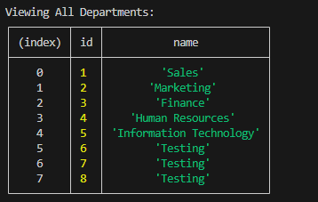

# SQL-Employee-Tracker

## Description
Developers frequently have to create interfaces that allow non-developers to easily view and interact with information stored in databases. For this week's challenge, we are required to use Node.JS, Inquirer and MySQL to build a command-line application from scratch to manage a company's employee database.

## Installtion
1. Open the terminal window and install your NPM package and required dependencies by typing npm i
2. Once you have the dependencies installed connect your mysql2 to connect to your database and perform queries by typing mysql - u root -p. This will intialise MySQL.
3. Once you have run those commands run the server.js command to invoke the functionality.

## User Story

```md
AS A business owner
I WANT to be able to view and manage the departments, roles, and employees in my company
SO THAT I can organize and plan my business
```

## Acceptance Criteria

```md
GIVEN a command-line application that accepts user input
WHEN I start the application
THEN I am presented with the following options: view all departments, view all roles, view all employees, add a department, add a role, add an employee, and update an employee role
WHEN I choose to view all departments
THEN I am presented with a formatted table showing department names and department ids
WHEN I choose to view all roles
THEN I am presented with the job title, role id, the department that role belongs to, and the salary for that role
WHEN I choose to view all employees
THEN I am presented with a formatted table showing employee data, including employee ids, first names, last names, job titles, departments, salaries, and managers that the employees report to
WHEN I choose to add a department
THEN I am prompted to enter the name of the department and that department is added to the database
WHEN I choose to add a role
THEN I am prompted to enter the name, salary, and department for the role and that role is added to the database
WHEN I choose to add an employee
THEN I am prompted to enter the employee’s first name, last name, role, and manager, and that employee is added to the database
WHEN I choose to update an employee role
THEN I am prompted to select an employee to update and their new role and this information is updated in the database 
```

## Screenshots of Terminal

### Prompt Screen


### Departments Table


### Add a Role


### Roles table


## Link to demo
https://drive.google.com/file/d/1DWZIbGHtme9UpNT8A2JH_53YyNywJB3F/view

## Link to Github Repository
https://github.com/Saria995/SQL-Employee-Tracker.git 